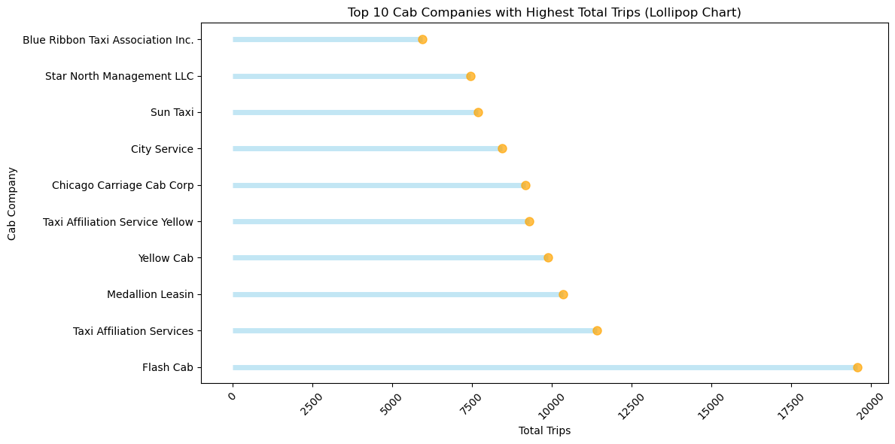
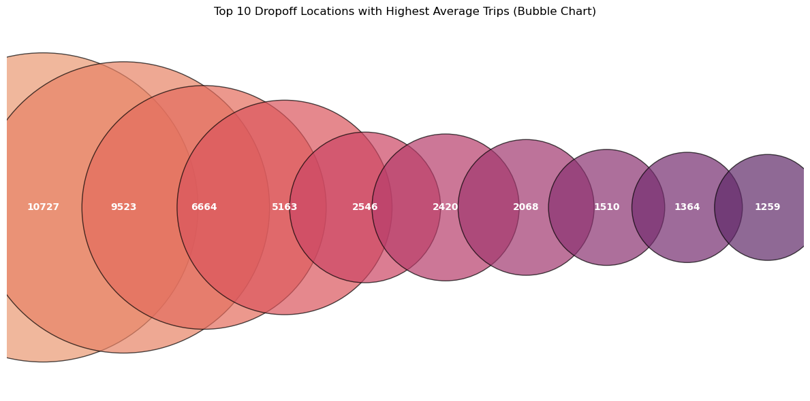

# 🚕 Chicago Cab Company EDA

A simple but effective **Exploratory Data Analysis (EDA)** of cab company performance using:

- 📊 **Pandas** for data manipulation  
- 🖼️ **Matplotlib & Seaborn** for visualizations  
- 📈 **SciPy** for statistical testing  

---

## 🔍 Project Summary

This project explores taxi trip data in Chicago, with a focus on:

- Identifying the top-performing cab companies  
- Analyzing trip patterns and durations  
- Studying how **weather conditions** affect travel time  
- Testing hypotheses using **t-tests**

---

## 📂 Tools Used

| Tool       | Purpose                      |
|------------|------------------------------|
| `pandas`   | Data wrangling               |
| `seaborn`  | Statistical visualizations   |
| `matplotlib` | Plot customization          |
| `scipy.stats` | Hypothesis testing         |

---

## 📌 Key Insights

- Flash Cab dominates with the highest number of total trips.
- Rainy Saturdays significantly increase trip duration from the Loop to O'Hare.
- Dropoff hotspots like the Loop and River North consistently show higher average demand.

---

## 📸 Visual Examples

---

## 🧪 Statistical Test Example

We tested the hypothesis:

> **"The average duration of rides from the Loop to O'Hare changes on rainy Saturdays."**

- ✅ **Result:** Statistically significant difference found  
- 📉 **T-statistic:** `5.53`  
- 📊 **P-value:** `9.13e-08`  
- 🎯 **Alpha level:** `0.05`

---
